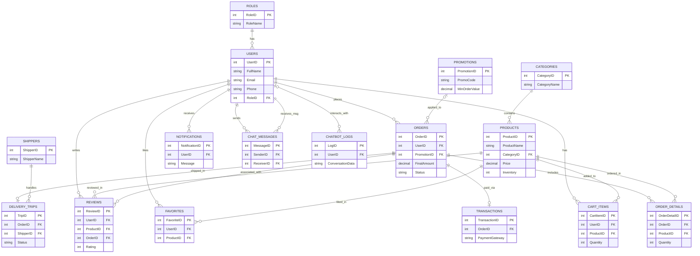

# Mô hình Thực thể (ER Model) - Dự án FiveFood

Dưới đây là tài liệu mô tả cấu trúc cơ sở dữ liệu (Database Schema) của dự án **FiveFood**. Hệ thống bao gồm **16 bảng chính** có quan hệ chặt chẽ với nhau.

## 1. Sơ đồ quan hệ thực thể (Mermaid ER Diagram)

Bạn có thể tham khảo sơ đồ trực quan dưới đây để hình dung tổng quan về toàn bộ các bảng và mối liên kết (ràng buộc khóa ngoại - Foreign Key).

## 2. Hướng dẫn chi tiết vẽ trên PowerDesigner (Cardinality)

Để vẽ chính xác trong PowerDesigner (ở mức Physical Data Model - PDM hoặc Conceptual Data Model - CDM), dưới đây là danh sách phân tích chuẩn hóa các mối quan hệ (1-n, n-n) giữa các bảng:

### Các mối quan hệ 1-N (One-to-Many)
Đây là các mối quan hệ một-nhiều cơ bản, khóa chính (PK) của bảng "1" sẽ là khóa ngoại (FK) trong bảng "N":

1. **`Roles` (1) - (N) `Users`**: Một vai trò (VD: Admin) có nhiều người dùng.
2. **`Categories` (1) - (N) `Products`**: Một danh mục (VD: Bánh mì) có nhiều sản phẩm.
3. **`Users` (1) - (N) `Orders`**: Một khách hàng có thể đặt nhiều đơn hàng.
4. **`Promotions` (1) - (N) `Orders`**: Một mã giảm giá có thể áp dụng cho nhiều đơn hàng.
5. **`Shippers` (1) - (N) `DeliveryTrips`**: Một nhân viên giao hàng có thể thực hiện nhiều chuyến giao.
6. **`Orders` (1) - (N) `DeliveryTrips`**: Một đơn hàng có thể có nhiều trạng thái chuyến giao hàng (từ lúc lấy hàng đến lúc giao xong).
7. **`Users` (1) - (N) `Notifications`**: Một người dùng có thể nhận nhiều thông báo.
8. **`Users` (1) - (N) `ChatbotLogs`**: Một người dùng có thể có nhiều lượt chat với AI.

*(Lưu ý về ChatMessages)*: Bảng `ChatMessages` có 2 khóa ngoại đều trỏ về bảng `Users`:
9. **`Users` (1) - (N) `ChatMessages` (Sender)**: Một người gửi nhiều tin nhắn.
10. **`Users` (1) - (N) `ChatMessages` (Receiver)**: Một người nhận nhiều tin nhắn.

### Các mối quan hệ 1-1 (One-to-One / One-to-Zero-or-One)
11. **`Orders` (1) - (1) `Transactions`**: Mỗi đơn hàng trực tuyến chỉ có 1 giao dịch thanh toán (Transaction). Khóa chính `OrderID` của Orders làm khóa ngoại ở Transactions.

### Các mối quan hệ N-M (Many-to-Many)
Trong PowerDesigner (mức PDM), mối quan hệ N-M phải được tách ra thành một **bảng trung gian (Junction Table)** với 2 mối quan hệ 1-N. Dưới đây là các bảng đóng vai trò trung gian giải quyết quan hệ nhiều-nhiều:

12. **Quan hệ N-M giữa `Users` và `Products` (Món ăn trong giỏ hàng)**:
    - Bảng trung gian: **`CartItems`**
    - Tách thành: `Users` (1) - (N) `CartItems` (N) - (1) `Products`

13. **Quan hệ N-M giữa `Orders` và `Products` (Chi tiết đơn hàng)**:
    - Bảng trung gian: **`OrderDetails`**
    - Tách thành: `Orders` (1) - (N) `OrderDetails` (N) - (1) `Products`

14. **Quan hệ N-M giữa `Users` và `Products` (Yêu thích món ăn)**:
    - Bảng trung gian: **`Favorites`**
    - Tách thành: `Users` (1) - (N) `Favorites` (N) - (1) `Products`

15. **Quan hệ N-M phức hợp giữa `Users`, `Products` và `Orders` (Đánh giá)**:
    - Bảng trung gian: **`Reviews`**
    - Tách thành 3 nhánh:
      - `Users` (1) - (N) `Reviews`
      - `Products` (1) - (N) `Reviews`
      - `Orders` (1) - (N) `Reviews` (Mỗi đơn hàng có thể có nhiều dòng review cho từng món).

---
*Mẹo khi vẽ trên PowerDesigner (PDM)*: 
- Đối với các bảng như `CartItems`, `OrderDetails`, `Favorites`, và `Reviews`, bạn cứ tạo các mối quan hệ **1-n (Reference)** từ các bảng chính (Users, Products, Orders) trỏ vào chúng. 
- Khóa chính của bảng gốc (VD: UserID, ProductID) sẽ tự động trở thành Khóa ngoại (Foreign Key) ở bảng trung gian.
